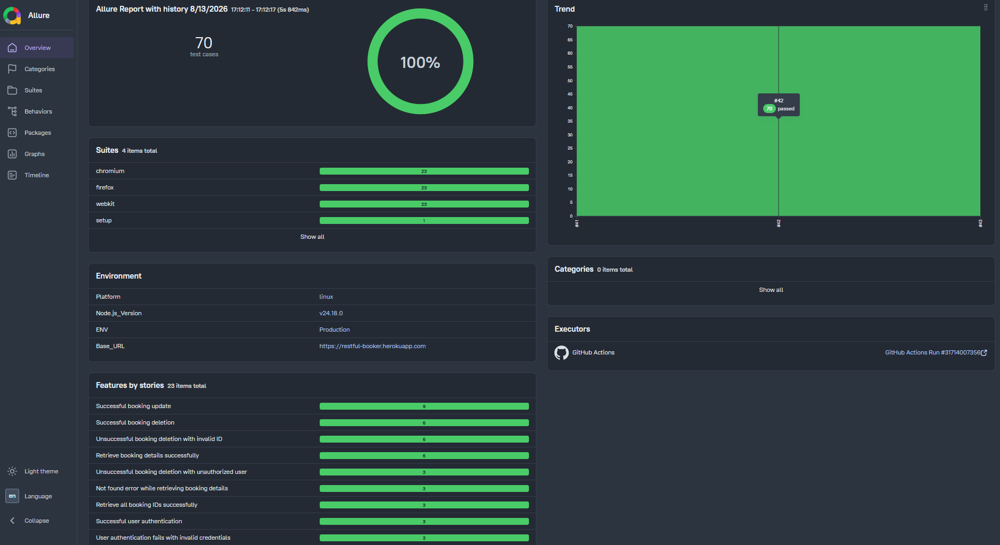

# 🎭 Playwright API+DB Testing Portfolio Project

[](https://github.com/michalwarunek/api-playwright-portfolio/actions)
[](https://michalwarunek.github.io/api-playwright-portfolio/)

A comprehensive API+DB test automation framework for the [Restful-Booker](https://restful-booker.herokuapp.com/) application, built with **TypeScript** and **Playwright**. This project features a fully automated CI/CD pipeline and dynamic **Allure Reports** deployed directly to GitHub Pages.

---

## 📊 Live Allure Report

View the latest interactive test execution report with build history:  
**[](https://michalwarunek.github.io/api-playwright-portfolio/)**
*(Click the image above to open the full interactive report)*

---

## 🛠️ Tech Stack

* **Language:** TypeScript
* **Test Framework:** Playwright (API + Database Testing)
* **Database:** SQLite3 (`sqlite` wrapper)
* **Reporting:** Allure Playwright
* **CI/CD:** GitHub Actions
* **Report Hosting:** GitHub Pages
* **Target Application:** Restful-Booker (Node.js/Express)

---

## 🎯 Test Scope & Capabilities

### 🌐 API Testing
Full end-to-end API coverage for the Restful-Booker services, including:
* **`GET`** – Fetching single and multiple bookings.
* **`POST`** – Creating new bookings and generating auth tokens.
* **`PUT`** – Updating existing booking resources with authentication.
* **`DELETE`** – Deleting booking records and validating authorization safeguards.

### 🗄️ Database Testing (SQLite)
Comprehensive relational database testing verifying integrity, constraints, and complex queries:
* **CRUD Operations:** `SELECT`, `INSERT`, `UPDATE`, `DELETE` (including foreign key cascade delete checks).
* **Advanced Queries & Joins:**
  * `INNER JOIN` – Verifying matches between related entities.
  * `LEFT JOIN` – Validating non-matching parent records with optional payments.
  * `RIGHT JOIN (Simulated)` – Emulated using `LEFT JOIN` with swapped table order/columns to verify payment records without matching booking headers in SQLite.

---

## 🚀 Getting Started

### Prerequisites

* Node.js (v18+)
* Git

### Installation

1. **Clone the repository:**
   ```bash
   git clone [https://github.com/michalwarunek/api-playwright-portfolio.git](https://github.com/michalwarunek/api-playwright-portfolio.git)
   cd api-playwright-portfolio
   ```
2. **Install dependencies:**

   ```bash
   npm install
   ```
3. **Set up the local test application (Restful-Booker):**

The application is automatically executed as a webServer during test runs. Clone it into the project root directory:

```bash
git clone [https://github.com/mwinteringham/restful-booker.git](https://github.com/mwinteringham/restful-booker.git)
cd restful-booker
npm install
cd ..
```
(Note: The restful-booker/ directory is listed in .gitignore and will not be tracked by Git).

## 🧪 Running Tests
**Run all API tests**
```bash
npx playwright test
```
**Run tests and open the built-in Playwright HTML report**
```bash
npx playwright show-report
```
**Generate and serve the Allure Report locally**
```bash
npx allure serve allure-results
```
## 🔄 CI/CD Pipeline & GitHub Actions
The GitHub Actions workflow triggers automatically on every push or pull_request to the main branch:
+ Clones the project repository alongside the restful-booker target app.
+ Starts the local API server on port 3001.
+ Dynamically injects environment metadata (environment.properties).
+ Generates the Allure Report and deploys it to GitHub Pages with historical trend retention.


## 📁 Project Structure
```files
├── .auth/                  # Stored authentication state / tokens
├── .github/                # GitHub Actions workflows and CI/CD configs
├── api/                    # API client
├── db/                     # Database clients
├── docs/                   # Additional project documentation
├── fixtures/               # Playwright test fixtures and custom setups
├── helpers/                # Reusable helper functions and utility modules
├── test-data/              # Static or dynamic test data (payloads, JSONs)
├── tests/                  # API and DB test suites
│   ├── api/                # API test specs
│   ├── auth/               # Authentication test specs
│   └── db/                 # Database test specs
├── .gitignore              # Git ignored files and directories
├── package.json            # Project dependencies, metadata, and scripts
├── playwright.config.ts    # Main Playwright configuration
└── Readme.md               # Project documentation
